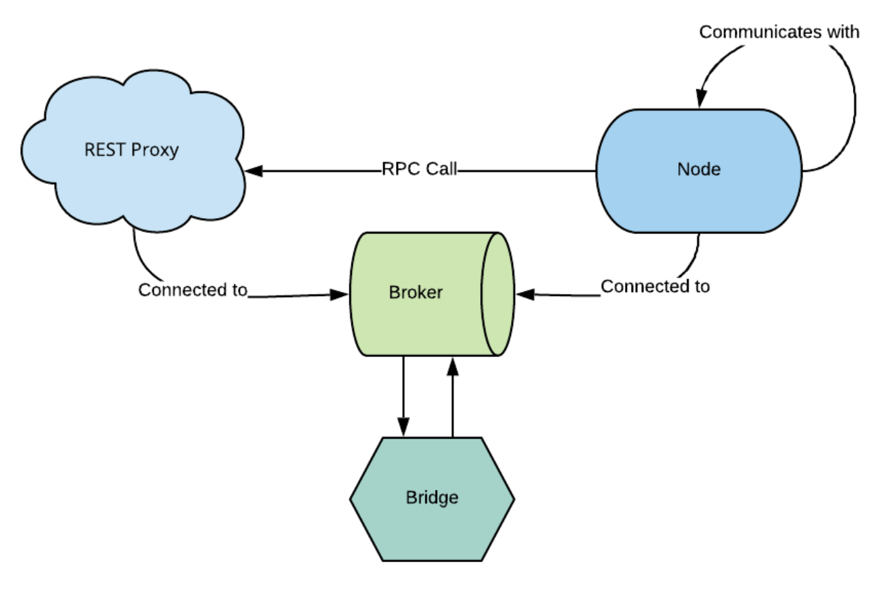

# MECO 
A library built upon MDE methodologies for modeling the entities and the communications of asynchronous message-driven systems.

<figure>
  
  <figcaption><i>Overview of the described systems</i></figcaption>
  <br>
</figure>

MECO provides a DSL (Domain Specific Language) for defining the entities and the ports that transfer the messages through the system. It references comm-idl, a DSL for defining the data models of the messages and broker-dsl, a DSL for defining the connection parameters with the brokers.

Currently the supported message transfer protocols are:
- AMPQ
- MQTT
- REDIS

and the implemented communication patterns are:
- pub-sub
- RPC


## How it works
### Syntax
The syntax of the model definitions is governed by 3 rules
1. Assignment of a value, declared by the character ":". The attribute can have a single value or other attributes as value. A publisher is defined as below

    ```
    publisher:
        topic: room.temperature
        frequency: 1
    ```
    Where topic has the single value of "room.temperature" and publisher has two attributes; topic and frequency.

2. Assignment of a list of values, declared by the character "-". For example, the definition of an output port looks like this.
    ```
    outports:
        - publisher
        - rpc_client secoRPC
    ```

3. Declaration of an object. The object type precedes the object name and then follow its attributes inside of "{}". For example, a node is defined as below
    ```
    Node CapeCanaveralPC {
        outports:
            - publisher:
                topic: shuttle.liftoff
                message: SpaceShuttleMsg
                frequency: 10
            - rpc_client secoRPC:
                message: SECOMsg
        inports:
            - subscriber:
                topic: countdown.left
    }
    ```

### Broker Definition
Broker models are defined according to the broker-dsl grammar.
```
brokerType brokerName -> {
    attributes
}
```
The possible values of brokerType are: "RabbitBroker", "AMQPBroker", "MQTTBroker", "EMQXBroker" and "RedisBroker". The attributes of each broker can be found in this repo https://github.com/robotics-4-all/broker-dsl

### Message Definition
The properties of the messages can be either a simple property declared like this `name: type default_value` or a list property declared like this `name: type[] default_value`. In both cases, *type* is a primitive data type (string, integer, float, boolean) or an Object defined in comm-idl as follows
```
Object name{
    properties
}
```
 
#### PubSubMessage
The syntax of these messages is the following
```
PubSubMessage msgName{
    properties
}
```

#### RPCMessage
These messages contain both the request and the response part
```
RPCMessage msgName{
    RPCRequest
    ---
    RPCResponse
}
```
where RPCRequest and RPCRequests are properties described above.

### MECO Definition
The systems described by MECO have 4 entities, the syntax of each is described below.

#### Broker
`Broker: brokerName (default)`

brokerName is the name of the referenced object from the broker model. There is the possibility to declare a broker as the default for the system by appending "(default)" next to brokerName.

#### Node
A node has the following syntax.
```
Node nodeName{
    outports: outports
    inports: inports
    broker: Broker
}
```
An outport can either be a Publisher or an RPC_Client. The publisher is declared like this.
```
publisher:
    topic: value
    message: msgName
    frequency: int
    mock: bool
```
and the rpc client like this
```
rpc_client name:
    message: msgName
    frequency: int
    mock: bool
```
If set True, the mock attribute sets the outports to simulation mode, in which the messages are given random data before they are sent.

An inport can either be a Subscriber or an RPC_Service. The subscriber is declared like this.
```
subscriber:
    topic: value
```
and the rpc service like this
```
rpc_service name:
    message: msgName
```

#### Bridge
There are two type of bridges; the TopicBridge and the RPCBridge.

The TopicBridge is declared like this
```
TopicBridge bridgeName{
    brokerA(fromTopic) - brokerB(toTopic)
}
```

and the RPCBridge like this
```
RPCBridge bridgeName{
    brokerA(nameA) - brokerB(nameB)
}
```

#### RESTProxy
A rest proxy declaration has the following syntax.
```
RESTProxy proxyName{
    attributes
}
```
The attributes of a proxy are shown in the table below.
| Attribute | Required |                       Value                       |
|:---------:|:--------:|:-------------------------------------------------:|
| port      | YES      | RPC_Service                                       |
| url       | YES      | String                                            |
| method    | YES      | Possible values: "GET", "POST", "DELETE", "PATCH" |
| body      | NO       | Reference to an Object of the messages model      |
| path      | NO       | Reference to an Object of the messages model      |
| query     | NO       | Reference to an Object of the messages model      |
| header    | NO       | Reference to an Object of the messages model      |
| broker    | NO       | Reference to a Broker of the brokers model        |


### Code Generation
The code generator performs a model-to-text transformation to generate python files that implement the entities of the model. The generator is activated with the execution of the following command.

```
$ python parser.py --model modelName --messages messageName
```

where modelName is the name of the MECO model and messageName is the name of the comm-idl model.

The generated files are in the **meco/code_outputs** directory.

### Documentation Generation
Besides the code, there is a documentation generator that creates diagrams and markdown files that describe the endpoints and the connections of the system. This generator is activated with the execution of the following command.

```
$ python doc_parser.py --model modelName
```

The generated files are in the **meco/doc_outputs** directory.


## Installation
To install this library clone the repo and run
```
$ python setup.py install
```


## Examples - Demo
Examples models can be found in the [examples](examples) directory, covering the functionality of all 4 entities.

Moreover, a demo can be found in the [demo](demo) directory, in which MECO is applied to a "smart home" environment implementing the API for the communication of the house's devices.