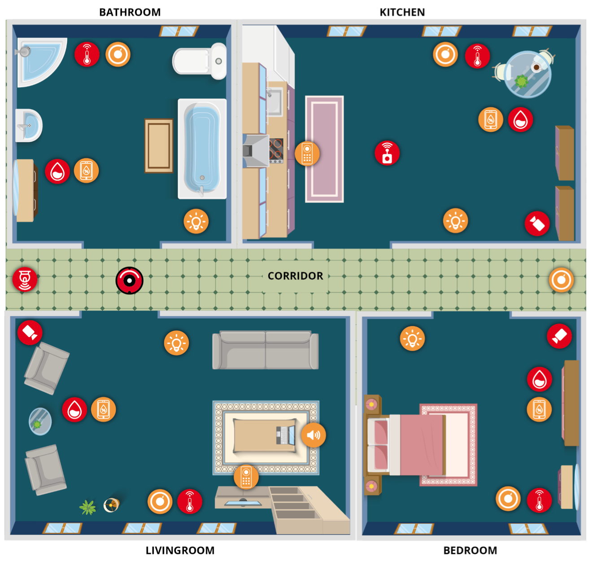

## Demo
In this demo, MECO is applied to the "Smart Home" environment show in the image below

<figure>
  
  <figcaption><i>Floor-Plan of the Smart Home</i></figcaption>
  <br>
</figure>

### Environment Descritpion
The house consists of 4 rooms and a wide corridor. Each room has installed physical objects, sensors and effectors. For example, in the kitchen there is a humidity and a temperature sensor and there is also a humidifier, a thermostat and a kitchen relay.

The purpose of this demo is to use MECO to create an API that describes the communications of those devices. Below is a table with a part of this API.

|          Topic URI          |            DataModel            |                                                                       Description                                                                       |
|:---------------------------:|:-------------------------------:|:-------------------------------------------------------------------------------------------------------------------------------------------------------:|
| {room_id}.temperature       | { temperature: 0.0 }            | Publishes temperature measurements with a frequency of 1 Hz                                                                                             |
| {room_id}.humidity          | { humidity: 0.0 }               | Publishes humidity measurements with a frequency of 1 Hz.                                                                                               |
| {room_id}.intruder_detected | { position: (0,0) }             | Publishes a message when a human intruder is detected using the installed camera sensor.<br> The message contains the position of the intruder in 2D space. |
| kitchen.kitchen_relay       | { state: 0 }                    | Listens for the state commands to enable/disable the thermostat                                                                                         |
| robot.pose                  | { translation: {x:0, y:0, z:0}} | Publishes the pose of the base of the robot with a frequency of 1Hz.                                                                                    |


### API Implementation
To implement the API, a brokers, a message and a MECO model have been created in this directory.

To generate the entity files just run
```
$ python parser.py --model ../demo/smart_home.ent --messages ../demo/sh_messages.idl
```
inside the *meco* directory

and to generate the documentation files run
```
$ python doc_parser.py --model ../demo/smart_home.ent
```

This commands are also included in the **run_demo.sh** file.